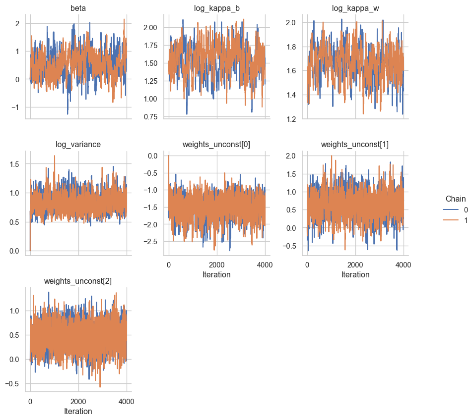

# VPMM Sim Example
wiep & isammarques
2023-05-22

## Load packages

``` python
import jax.numpy as jnp
import liesel.goose as gs
import matplotlib.pylab as plt
import numpy as np
import scipy.spatial as spat
from scipy.stats import multivariate_normal

import vpmm.model as vpmm
from vpmm.covarfun import exponential_covariance
```

## Generate Data

Set a seed for generating the data.

``` python
np.random.seed(2)
```

Specify datasize and set parameter values.

``` python
npoints_lvl1 = 60
npoints_lvl2 = 27

beta = np.array([1.0])
design_mat = np.array([np.ones(npoints_lvl1 * npoints_lvl2)]).T
variance = 2.0
kappa_b = 3 / 0.5  # = 6;    ln = 1.7917594692
kappa_w = 3 / 0.7  # = 4.28; ln = 1.4552872326
weights = vpmm.Weights(0.1, 0.35, 0.35, 0.2)
print(f"weight values on the simples: {weights.to_stan_simplex()}.")
```

    weight values on the simples: [-1.0986123   0.24116209  0.55961573].

Draw locations of plots and observations within the plots.

``` python
loc_plot = np.random.uniform(size=(npoints_lvl1, 2))
loc_obs = np.random.uniform(size=(npoints_lvl2, 2))
```


Calculate distances, covariance matices, and draw the random quantities.
Then. put everything together to get the response.

``` python
# distances
dist_areas = spat.distance_matrix(loc_plot, loc_plot)
dist_obs = spat.distance_matrix(loc_obs, loc_obs)

# Calc covariance matrices and draw spatial effects

# between
sigma_b = exponential_covariance(dist_areas, kappa_b, 1.0)

gamma_b = multivariate_normal.rvs(cov=sigma_b, size=1)
# print(f"gamma_b {gamma_b}")

gamma_b_kron = np.array(np.kron(gamma_b, np.ones(dist_obs.shape[0])))

# within
sigma_w = exponential_covariance(dist_obs, kappa_w, 1.0)

sigma_w_repeated = np.kron(np.eye(np.shape(sigma_b)[0]), sigma_w)
gamma_w = multivariate_normal.rvs(cov=sigma_w_repeated, size=1)

# interaction
sigma_inter = np.kron(sigma_b, sigma_w)
gamma_inter = multivariate_normal.rvs(cov=sigma_inter, size=1)

# draw nugget
eps = np.random.normal(0, scale=1.0, size=sigma_b.shape[0] * sigma_w.shape[0])


# put it all all together
response = design_mat @ beta + np.sqrt(variance) * (
    np.sqrt(weights.between) * gamma_b_kron
    + np.sqrt(weights.within) * gamma_w
    + np.sqrt(weights.interaction) * gamma_inter
    + np.sqrt(weights.nugget) * eps
)
```

## Setup Model

``` python
# Build the model
builder = vpmm.M4Builder(response, design_mat, loc_plot, loc_obs)

# set duration of warm up phase and posterior sampling phase
builder.dur_warmup = 2000
builder.dur_term = 300
builder.dur_posterior = 2000
builder.track_gamma_b = False

# set number of chains
builder.num_chains = 2


# change the priors default values
# builder.priors.weights = vpmm.SimplexPriorStan(weights)

# change the inital values
# builder.init_params.weights_unconst = weights.to_stan_simplex()

# builder.init_params.beta = jnp.array([1.0])
# builder.init_params.log_variance = jnp.log(variance)
# builder.init_params.gamma_b = gamma_b

# builder.init_params.log_kappa_b = 1.7917594692
# builder.init_params.log_kappa_w = 1.4552872326


# change the default sampler values
builder.kernels = [
    # gs.NUTSKernel(
    #     [
    #         "beta",
    #         "log_variance",
    #         "weights_unconst",
    #     ],
    # ),
    gs.HMCKernel(
        [
            "beta",
            "log_variance",
            "weights_unconst",
        ],
    ),
    gs.RWKernel(
        [
            "log_kappa_b",
            "log_kappa_w",
        ],
    ),
]

model = builder.build()
```

## Sample

sample from the posterior

``` python
engine = model.engine
engine.sample_all_epochs()
```

    INFO - Starting epoch: FAST_ADAPTATION, 75 transitions, 25 jitted together
    WARNING - Errors per chain for kernel_00: 12, 11 / 75 transitions
    INFO - Finished epoch
    INFO - Starting epoch: SLOW_ADAPTATION, 25 transitions, 25 jitted together
    WARNING - Errors per chain for kernel_00: 3, 3 / 25 transitions
    INFO - Finished epoch
    INFO - Starting epoch: SLOW_ADAPTATION, 50 transitions, 25 jitted together
    WARNING - Errors per chain for kernel_00: 4, 3 / 50 transitions
    INFO - Finished epoch
    INFO - Starting epoch: SLOW_ADAPTATION, 100 transitions, 25 jitted together
    WARNING - Errors per chain for kernel_00: 9, 12 / 100 transitions
    INFO - Finished epoch
    INFO - Starting epoch: SLOW_ADAPTATION, 200 transitions, 25 jitted together
    WARNING - Errors per chain for kernel_00: 17, 14 / 200 transitions
    INFO - Finished epoch
    INFO - Starting epoch: SLOW_ADAPTATION, 400 transitions, 25 jitted together
    WARNING - Errors per chain for kernel_00: 17, 16 / 400 transitions
    INFO - Finished epoch
    INFO - Starting epoch: SLOW_ADAPTATION, 850 transitions, 25 jitted together
    WARNING - Errors per chain for kernel_00: 34, 33 / 850 transitions
    INFO - Finished epoch
    INFO - Starting epoch: FAST_ADAPTATION, 300 transitions, 25 jitted together
    WARNING - Errors per chain for kernel_00: 15, 20 / 300 transitions
    INFO - Finished epoch
    INFO - Finished warmup
    INFO - Starting epoch: POSTERIOR, 2000 transitions, 25 jitted together
    INFO - Finished epoch

### Summarize

Summarize the posterior samples.

``` python
results = engine.get_results()
res = gs.Summary.from_result(results, per_chain=False)
res
```

**Parameter summary:**

                               mean        sd    q_0.05     q_0.5    q_0.95  \
    parameter       index                                                     
    beta            (0,)   0.581643  0.401586 -0.069162  0.562180  1.273828   
    log_kappa_b     ()     1.532409  0.214564  1.153355  1.543938  1.861407   
    log_kappa_w     ()     1.641294  0.127999  1.429848  1.642124  1.847313   
    log_variance    ()     0.826130  0.138718  0.625331  0.813259  1.079070   
    weights_unconst (0,)  -1.480843  0.289357 -1.975416 -1.467498 -1.030725   
                    (1,)   0.631537  0.322668  0.100015  0.633988  1.159971   
                    (2,)   0.471858  0.244829  0.074355  0.472636  0.874858   

                           sample_size    ess_bulk     ess_tail      rhat  
    parameter       index                                                  
    beta            (0,)          4000  100.522380   211.840591  1.021003  
    log_kappa_b     ()            4000   62.071285   210.482423  1.055817  
    log_kappa_w     ()            4000  130.989011   247.149716  1.002493  
    log_variance    ()            4000  208.992017   576.170208  1.023412  
    weights_unconst (0,)          4000  278.045700   845.884096  1.006285  
                    (1,)          4000  213.068184   467.212016  1.017112  
                    (2,)          4000  409.282281  1166.162003  1.009645  

**Error summary:**

                                                        count  relative
    kernel    error_code error_msg            phase                    
    kernel_00 1          divergent transition warmup      223   0.05575
                                              posterior     0   0.00000

### Traceplots

Traceplots for the hyperparameters and regression coefficients.

``` python
gs.plot_trace(results, include_warmup=True)
plt.show()
```


